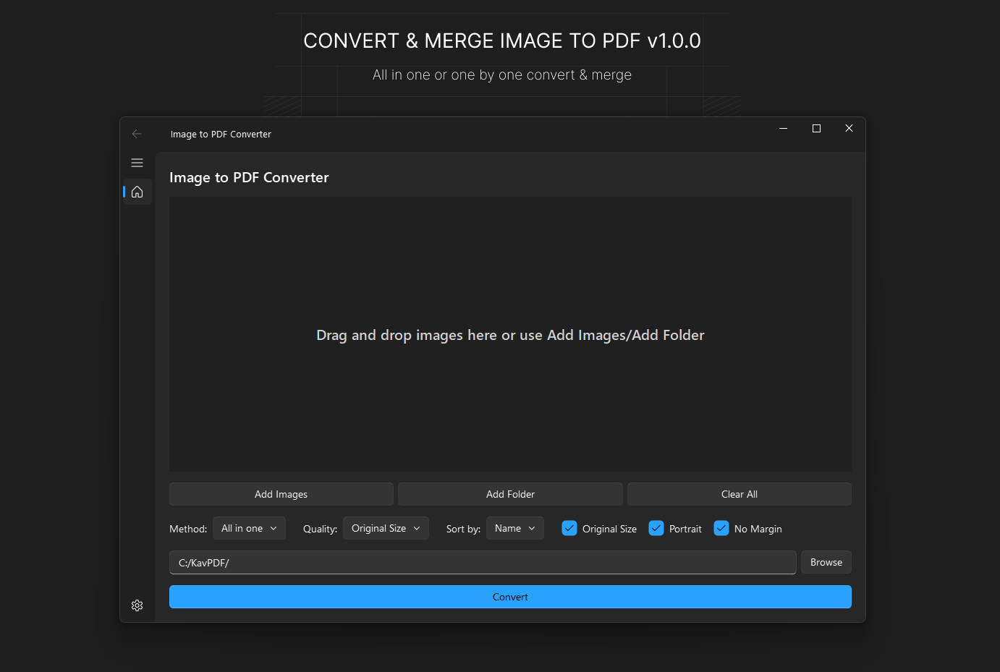

# Image & HTML to PDF Converter/Merge

A modern, beautiful, and powerful converter application that transforms **images** and **HTML files** to PDF. Built with Python and Qt (PyQt6 & QFluentWidgets).

**Features:**
- Convert images (PNG, JPG, JPEG, BMP, GIF, TIFF, WebP) to PDF
- Convert HTML files to PDF with full rendering support
- Merge multiple files (images and HTML) into a single PDF
- Individual conversion (one file → one PDF) or batch merge (all files → one PDF)
- Drag and drop support for easy file addition
- Multiple quality and compression options

## 🎉 What's New in Version 2.0

**HTML to PDF Conversion**
- ✅ Convert HTML files with pixel-perfect CSS rendering
- ✅ Uses your system Chrome/Edge (no extra browser download)
- ✅ Mix HTML and images in single PDF (HTML + HTML, HTML + Image, Image + Image)

**Advanced List Management**
- ✅ Drag & drop to reorder files
- ✅ Up/Down arrow buttons for precise ordering
- ✅ Remove button to delete files
- ✅ Multi-select support (Ctrl+Click)

**Real-time Progress Display**
- ✅ See conversion progress as it happens
- ✅ Timestamped logs with status icons
- ✅ Know exactly what's being processed

**UX Improvements**
- ✅ Auto-open output folder after conversion
- ✅ Cancel anytime during conversion
- ✅ Full Vietnamese & English localization



## 📥 for Normal Users (No Python Required)
If you just want to use the application, you do NOT need to install Python.

1. **Download**: Go to the `dist` folder (or releases page) and find `ImageToPDF.exe`.
2. **Run**: Double-click the `ImageToPDF.exe` file.
   - The app will start immediately.
   - You can move this file anywhere (USB drive, Desktop, etc.).

---

## 💻 for Python Users / Developers

If you want to modify the code or run it from source, follow these steps.

### Prerequisites
- Python 3.10 or higher installed.

### 1. Installation
Install the required libraries:
```bash
pip install -r requirements.txt
```
*Note: If `requirements.txt` is missing, manually install:*
```bash
pip install PyQt6 "PyQt6-Fluent-Widgets[full]" Pillow pypdf selenium pyinstaller
```

> **Note for HTML to PDF feature:** The application uses **Selenium** with your system's **Chrome** or **Edge** browser for HTML rendering. Make sure you have either Chrome or Edge installed on your system (most Windows systems already have Edge).

### 2. Running the App
You can run the application in two ways:
- **Option A**: Double-click `launch.bat`.
- **Option B**: Run via terminal:
  ```bash
  python launch.py
  ```

### 3. Building EXE (Creating Standalone File)
To create the `ImageToPDF.exe` file yourself:

1. Run the build script:
   ```bash
   python build.py --onefile
   ```
2. Wait for the process to finish.
3. The new `ImageToPDF.exe` will appear in the `dist` folder.

## ☕ Support the Project

If you find this tool useful, please support the author:

👉 **[Support on Ko-fi](https://ko-fi.com/solveproblem)**

## 📝 License
MIT License
